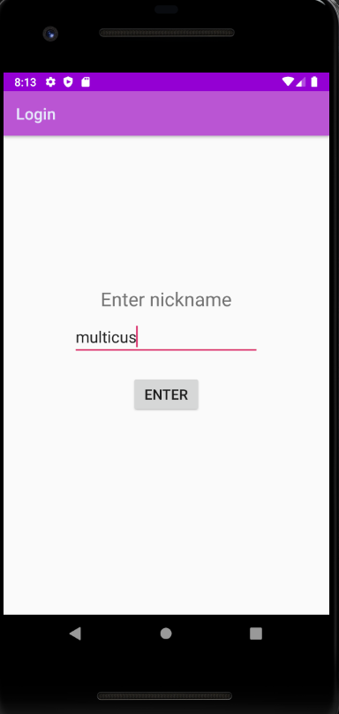
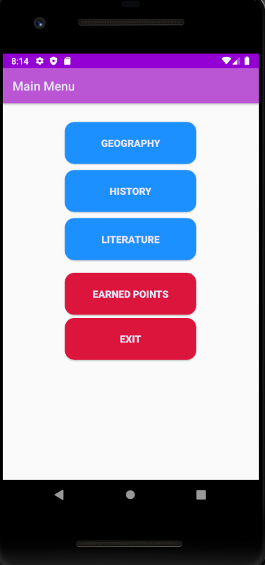
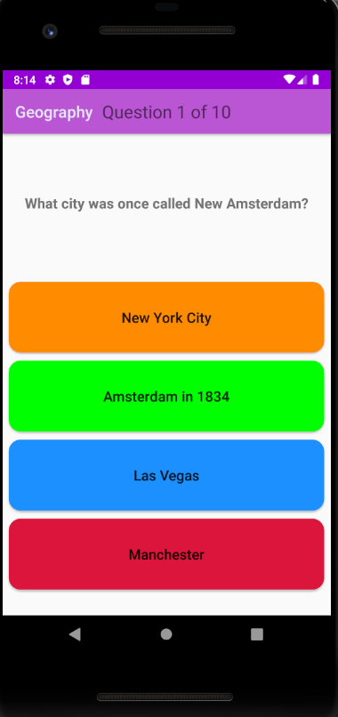
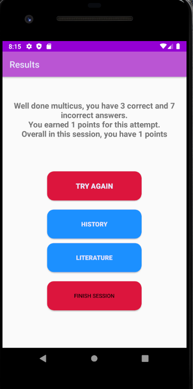
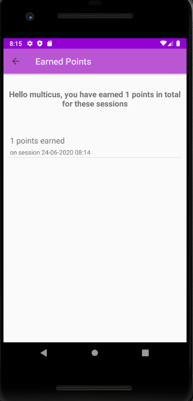

# Android World Quiz
 A small android quiz application with features including scoreboards, different subjects and logins.
 Each correct answer will give plus points, but wrong answers give you minus points.
 
 At the moment there are 3 different subjects, each containing 10 questions out of a bundle of 20 randomly chosen each time a new game is started.
 
 The scoreboard will keep track of all games and give you a total score from all your previous games.
 

## Showcase

